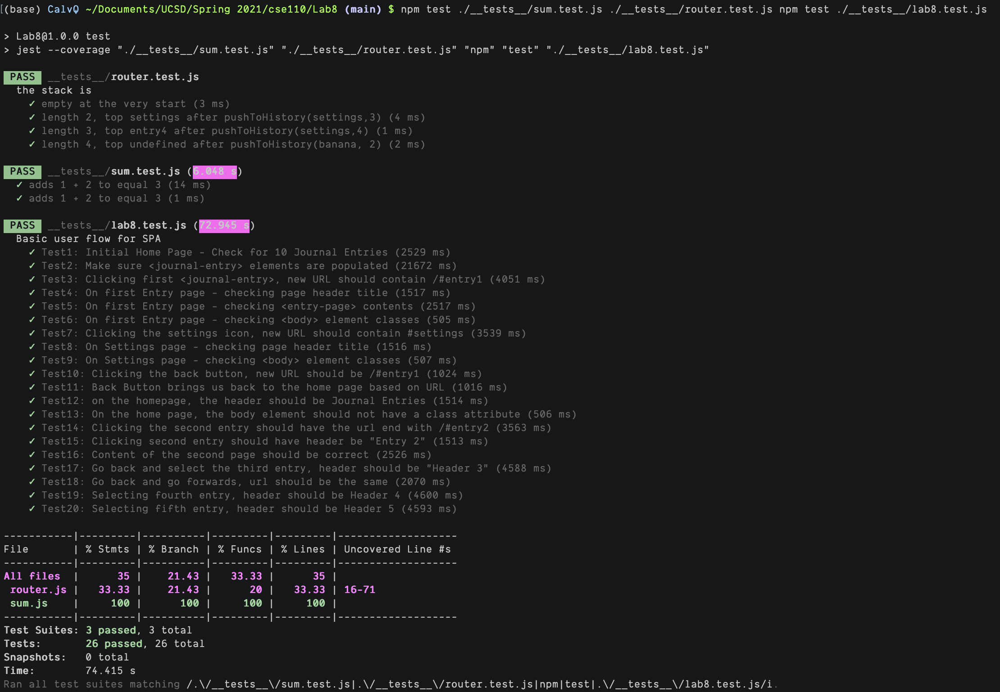

# Lab8

Calvin Qin

## Check your understanding q's
1. In your own words: Where would you fit your automated tests in your Bujo project development pipeline? (just write the letter)
1 - This ensures all code can at least run before being shared with everyone else, or at least problems are identified.

2. Would you use a unit test to test the “message” feature of a messaging application? Why or why not? For this question, assume the “message” feature allows a user to write and send a message to another user.
No, I would not because the message feature would relatively large scale and require a lot of moving parts. You would have to be able to type a message, send it, maybe show the message in a message log, then you need the other party to receive the message and display it. Therefore this would not be suitable for unit testing, which is more for small units. 

3. Would you use a unit test to test the “max message length” feature of a messaging application? Why or why not? For this question, assume the “max message length” feature prevents the user from typing more than 80 characters
Yes, this is a simple test that is appropriate for a unit test. By inputing various length messages, we can easily determine whether this max message length feature is working properly or not. 

4. What do you expect to happen if we run our puppeteer tests with the field “headless” set to true?
I expect that the tests will still run with the same results, but there will be no UI because everything will be done with a headless browser (meaning no display, but everything else runs the same).

5. What would your beforeAll callback look like if you wanted to start from the settings page before every test case?
You can manually click on the settings icon the top right, as that would lead to the settings page.

